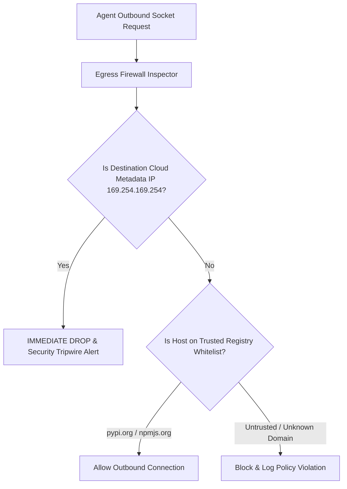

# GenPark AI Agent Skill - Agent Ephemeral Network Egress Firewall

Zero-dependency IP/CIDR and domain packet validator restricting sandbox outbound traffic to verified registries while blocking metadata endpoints (`169.254.169.254`).

Verified by [GenPark AI](https://genpark.ai) and compatible with [Model Context Protocol (MCP)](https://genpark.ai/mcp).

## Architecture Diagram

## Features
- **Anti-SSRF Armor**: Automatically drops requests targeting instance identity credentials.
- **Pure Python Standard Library**: Leverages built-in `ipaddress` module with zero external dependencies.
